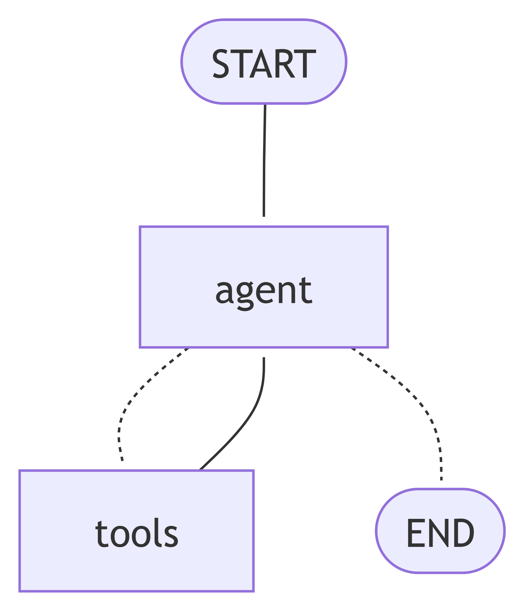

# Adeslas Health-Insurance Comparison Chatbot

This Retrieval-Augmented Generation (RAG) chatbot helps users **compare two Adeslas health-insurance policies—** **Adeslas GO** and **Adeslas Plena Total Vital**—and get contextual answers sourced directly from the official documents.  
The agent retrieves relevant chunks from both documents, merges them into a prompt and generates a response that highlights the differences or similarities between the two products.

---

## Features

- **Policy comparison** – queries are answered with references from both PDFs so the user can make an informed decision.  
- **Retrieval-Augmented Generation** – uses FAISS to search an indexed knowledge base and feed context to the LLM.  
- **Persistent chat history** – every session is tied to a **UUID**, allowing multi-turn conversations to be resumed.  
- **FastAPI backend & Gradio UI** – quick to run locally.  
- **Extensible tools** – additional retrieval or calculation tools can be added via LangGraph.

---

## Installation

1. **Requirements**
   - Python 3.9+
   - `pip`

2. **Clone the repository**
   ```bash
   git clone https://github.com/yourusername/your-repo.git
   cd your-repo
   ```

3. **(Recommended) Create and activate a virtual environment**
   ```bash
   python -m venv venv
   # Windows
   venv\Scripts\activate
   # macOS/Linux
   source venv/bin/activate
   ```

4. **Install dependencies**
   ```bash
   pip install -r requirements.txt
   ```

---

## Configuration

Create a `.env` file in the project root:

```env
GOOGLE_API_KEY=<your-google-api-key>
EMBEDDING_MODEL=models/gemini-embedding-001
CHAT_MODEL=gemini-2.5-flash
```

---

## How to Run

1. **Start the backend**
   ```bash
   uvicorn backend.api.main:app --reload
   ```
   The API will be available at `http://localhost:8000`.

2. **Start the frontend**
   ```bash
   python frontend/chat_ui.py
   ```
   A Gradio chat window will open and connect to `http://localhost:8000/chat`.

3. **(Optional) Update / rebuild the knowledge base**
   ```bash
   python backend/services/index.py
   ```
   Will extract text from pdfs on backend/data/docs to backend/data/docs/extractedText and use it to generate the FAISS index.
---

## Conversation & Memory

Each user session is initialised with a **thread-id UUID**:

```python
self.config = {"configurable": {"thread_id": str(uuid.uuid4())}}
```

LangGraph’s `MemorySaver` checkpoint stores messages keyed by this UUID, so the agent can:

1. Rehydrate past messages when the same UUID reconnects.  
2. Maintain long-term context across multiple turns without sharing it between different users.

---

## Agent Flow



1. **User** sends a question.  
2. **Agent node** decides whether a tool call is needed.  
3. If retrieval is required, the **`retrieve` tool** queries FAISS for the top-2 chunks from _Adeslas GO_ and _Adeslas Plena Total Vital_.  
4. Retrieved content is appended to the system prompt.  
5. **Chat Model** (Gemini) generates an answer (or another tool request).  
6. Response is stored in memory alongside the UUID.  
7. Conversation either loops for further tool calls or **ends**.

---

## Technologies Used

| Layer      | Tech                                                                   |
| ---------- | ---------------------------------------------------------------------- |
| LLM / Embeddings | Google Gemini (via `langchain-google-genai`)                      |
| Vector Store | FAISS (binary + metadata filters)                                     |
| Orchestration | LangGraph + LangChain tools                                          |
| API | FastAPI                                                                       |
| Front-end | Gradio                                                                  |

---

## Sample Q&A

### Example ADESLAS GO

**Question 1:**

**Q:** ¿Cuántas sesiones de podología están incluidas en Adeslas Go por año?
**A:** En Adeslas Go, tienes un máximo de doce sesiones de podología (tratamientos de quiropodia en consulta) por cada anualidad de seguro.(Referencia: 'Podología. Exclusivamente tratamientos de quiropodia en consulta. Con un máximo de doce sesiones por cada anualidad de seguro.')

**Question 2:**

**Q:** ¿Qué ocurre si no pago la prima de Adeslas Go a tiempo?
**A:** Si no pagas la prima de Adeslas Go a tiempo, las consecuencias varían según si es la primera prima o las sucesivas:Para la primera prima o fracción: Si no ha sido pagada por culpa del Tomador, la Aseguradora tiene derecho a resolver el contrato o a exigir el pago de la prima debida en vía ejecutiva con base en la póliza. Si la prima no ha sido pagada antes de que se produzca el siniestro, la Aseguradora quedará liberada de su obligación, salvo pacto en contrario.Para la segunda o sucesivas primas o fracciones: La cobertura quedará suspendida un mes después del día del vencimiento del recibo.(Referencia: '3.2. La primera prima o fracción de ella, será exigible conforme al artículo 15 de la Ley una vez firmado el contrato; si no hubiera sido pagada por culpa del Tomador, la Aseguradora tiene derecho a resolver el contrato o a exigir el pago de la prima debida en vía ejecutiva con base en la póliza. En todo caso, si la prima no ha sido pagada antes de que se produzca el siniestro, la Aseguradora quedará liberada de su obligación, salvo pacto en contrario. 3.3. En caso de falta de pago de la segunda o sucesivas primas o fracciones de ésta, la cobertura quedará suspendida un mes después del día del vencimiento del recibo')"

**Question 3:**

**Q:** ¿Puedo recibir asistencia psicológica con Adeslas Go? ¿Cuántas sesiones están cubiertas?
**A:** Sí, puedes recibir asistencia psicológica con Adeslas Go. El seguro cubre un máximo de veinte sesiones por cada anualidad de seguro, o cuarenta sesiones en caso de trastornos de la conducta alimentaria. Para ello, se requerirá la prescripción de un especialista en psiquiatría u oncología concertado y la autorización previa de la aseguradora.(Referencia: Adeslas Go, Condiciones Generales Descriptivas de la cobertura, página 15)

### Example ADESLAS PLENA TOTAL VITAL

**Question 1:**

**Q:** ¿Qué tipo de hospitalización cubre Adeslas Plena Total Vital?
**A:** Adeslas Plena Total Vital cubre la hospitalización en clínica u hospital concertado con la Entidad Aseguradora. Esta hospitalización se realizará siempre en habitación individual con cama para un acompañante, a excepción de las hospitalizaciones psiquiátricas, en U.V.I. y neonatológicas. La aseguradora se hará cargo de los gastos derivados de métodos diagnósticos y terapéuticos, tratamientos quirúrgicos (incluyendo gastos de quirófano y medicamentos) y estancias con manutención del enfermo, siempre que estén comprendidos en la cobertura de la póliza. Para ello, será necesaria la previa prescripción de un especialista concertado y autorización escrita de la Aseguradora. Se excluye la asistencia y tratamiento hospitalario por razones de tipo social.(Referencia: ADESLAS PLENA TOTAL: Condiciones Generales Descriptivas de la cobertura 2.6. HOSPITALIZACIÓN)

**Question 2:**

**Q:** ¿Está incluida la cirugía robótica en Adeslas Plena Total Vital?
**A:** Sí, la cirugía robótica está incluida en Adeslas Plena Total Vital, pero exclusivamente para el tratamiento quirúrgico del cáncer de próstata mediante prostatectomía radical, siempre y cuando se cumplan los siguientes criterios: diagnóstico de tumor maligno prostático localizado, PSA menor o igual a 15 ng/ml en el momento de la indicación quirúrgica, y ausencia de afectación extracapsular y/o de vesículas seminales en ecografía transrectal o medios de imagen (tumor estadificado como T1 o T2).Para acceder a esta asistencia, será necesaria la prescripción de un médico o facultativo especialista en urología y/o nefrología del Cuadro Médico, el pago previo de una franquicia de 6.000 euros y la autorización previa de la Aseguradora.(Referencia: 'El empleo de sistemas robóticos en cirugía se incluye exclusivamente para las siguientes indicaciones: · En el tratamiento quirúrgico del cáncer de próstata mediante prostatectomía radical en aquellos casos que cumplan todos los siguientes criterios: 1. Diagnóstico de tumor maligno prostático localizado; 2. PSA menor o igual a 15 ng/ml en el momento de la indicación quirúrgica; 3. Ausencia de afectación extracapsular y/o de vesículas seminales en la ecografía transrectal o medios de imagen (tumor estadificado como T1 o T2);', 'Para acceder a esta asistencia sanitaria será necesaria: - La prescripción por parte de un Médico o Facultativo especialista en urología y/o nefrología del Cuadro Médico. - El pago previo por el Asegurado y a la Aseguradora de una franquicia por importe de 6.000 euros. - La autorización previa emitida por la Aseguradora.')


### Example COMPARISON

**Question 1:**

**Q:** ¿Cuál de las dos pólizas cubre hospitalización completa, incluyendo cirugía y estancia?
**A:** ADESLAS PLENA TOTAL VITAL cubre la hospitalización completa, incluyendo cirugía y estancia. Esta póliza se hará cargo de los gastos derivados de métodos diagnósticos y terapéuticos, tratamientos quirúrgicos (incluyendo gastos de quirófano y medicamentos) y estancias con manutención del enfermo. La hospitalización se realizará en habitación individual en una clínica u hospital concertado, previa prescripción de un especialista y autorización de la aseguradora.Por otro lado, ADESLAS GO excluye la asistencia sanitaria que precise de hospitalización (ya sea en régimen de ingreso, cirugía ambulatoria u hospital de día) y las intervenciones quirúrgicas.(Referencia: 'ADESLAS PLENA TOTAL VITAL: 2.6. HOSPITALIZACIÓN Cualquier tipo de hospitalización se realizará en clínica u hospital concertado con la Entidad Aseguradora. Para ello será necesaria la previa prescripción de un especialista concertado y autorización escrita de la Aseguradora. La hospitalización se hará siempre en habitación individual que dispondrá de cama para el acompañante excepto en las hospitalizaciones psiquiátricas, en U.V.I. y neonatológicas, y serán por cuenta de la Aseguradora los gastos derivados de la realización de los métodos diagnósticos y terapéuticos, tratamientos quirúrgicos (incluidos gastos de quirófano y medicamentos) y estancias con la manutención del enfermo, comprendidos en la cobertura de la póliza.' y 'ADESLAS GO: A. La asistencia sanitaria que precise de hospitalización, ya sea en régimen de ingreso, cirugía ambulatoria u hospital de día, tanto si se trata de hospitalización programada o derivada de una urgencia. B. Las intervenciones quirúrgicas, inclusive las diagnósticas y/o terapéuticas. Se excluyen las pruebas diagnósticas o tratamientos por complicaciones que pudieran estar directa y/o principalmente causadas por haberse sometido a una intervención, infiltración o tratamiento de carácter puramente estético o cosmético.')"

**Question 2:**

**Q:** ¿Qué diferencias hay entre Adeslas Go y Plena Total Vital en cuanto a cobertura de psicología clínica?
**A:** Ambas pólizas, Adeslas Go y Adeslas Plena Total Vital, ofrecen cobertura de Psicología Clínica con un máximo de veinte sesiones por cada anualidad de seguro, o cuarenta sesiones en caso de trastornos de la conducta alimentaria. En ambos casos, se requiere la prescripción de un especialista en psiquiatría u oncología concertado y la autorización previa de la Aseguradora.La principal diferencia radica en que Adeslas Plena Total Vital especifica una serie de exclusiones para la cobertura de Psicología Clínica, incluyendo: psicoanálisis, hipnosis, test neuropsicológicos y psicométricos, sofrología, narcolepsia ambulatoria, cualquier método de asistencia psicológica no-conductual, la psicoterapia de grupo y la rehabilitación psicosocial. Estas exclusiones no se mencionan en la descripción de la cobertura de Psicología Clínica para Adeslas Go en el contexto proporcionado.(Referencia: 'Adeslas Go - Psicología Clínica: con un máximo de veinte sesiones por cada anualidad de seguro o cuarenta sesiones en caso de trastornos de la conducta alimentaria. Requerirá la pres-cripción de un especialista en psiquiatría u oncología concertado y la autorización previa de' y 'Adeslas Plena Total Vital - Psicología Clínica: con un máximo de veinte sesiones por cada anualidad de seguro o cuarenta sesiones en caso de trastornos de la conducta alimentaria. Requerirá la pres-cripción de un especialista en psiquiatría u oncología concertado y la autorización previa de la Aseguradora. Se excluye el psicoanálisis, hipnosis, test neuropsicológicos y psico-métricos, sofrología, narcolepsia ambulatoria, cualquier método de asistencia psicológi-ca no-conductual, la psicoterapia de grupo y la rehabilitación psicosocial.')"
